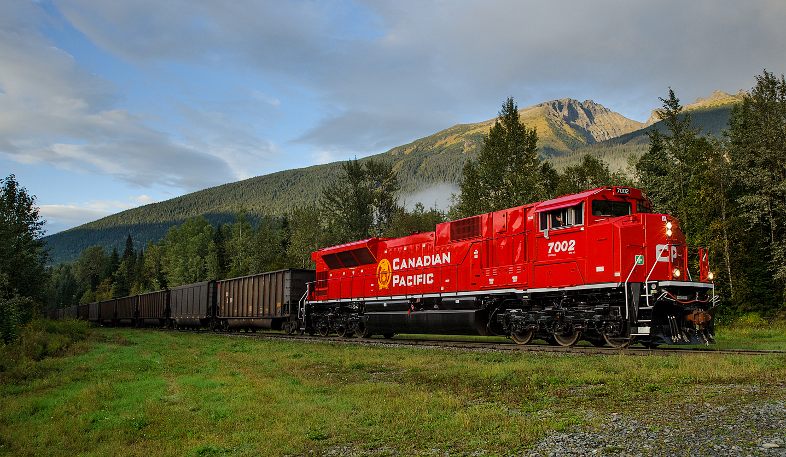

# OOP Training

> This is the second of a set of exercises that follow the evolution of a program to manage trains. This set is cumulative and will build upon previous exercises.

## Objectives

This exercise will allow you to demonstrate:

- your ability to read and interpret a class diagram
- coded a class based on a class diagram and set of specifications
- implement validation within a class given a set of specifications
- write unit tests to vertify the coded class is valid

## Overview

Your task is to generate a set of simple data types to represent the primary objects for managing trains. 

For this exercise, place all the required data types in the namespace `TrainSystem` and ensure that the classes are `public`.  Each class will represent an item (Engine *(Exercise 1)*, RailCar *(Given)*, or Train). Certain characteristics of each item are set and cannot be altered. You will need to read the specifications carefully to determine the access levels for item characteristics. You will need to write the unit tests for this exercise to demonstrate your objects can hold appropriate data.

### General Validation Rules

All validation is to be performed by throwing exceptions. Here are some general requirements.

- Exceptions must have meaningful error messages and be of an appropriate type
  - missing value in parameter: ArgumentNullException
  - incorrect value for parameter: ArgumentException, ArgumentOutOfRangeException, or FormatException
- Error messages must include details about the limits for acceptable values.
- Weights must always be positive and non-zero whole numbers. Weights are to be in 100 pound increments (all weights are in pounds).
- All string information must contain text. Null, empty, and plain white-space text is not allowed. Sanitize your strings by trimming the leading and trailing whitespace.
- All **public** level mutators must have necessary validation within the properties.

 ## Supplied class

### The `RailCar`

Railcars carry various kinds of goods. Each railcar is stenciled with certain information:

- **Serial Number** (e.g.: "18172") - Uniquely identifies a specific car; may include characters and digits in the number. Once set, cannot be altered.
- **Light Weight** (in pounds) - The weight of the railcar when empty.
- **Capacity** (in pounds) - Standard maximum Net Weight. This is the "ballpark" figure used when loading a railcar. The actual scale weight may be slightly higher or lower for what is considered a "full" load.
- **Load Limit** (in pounds) - Absolute maximum Net Weight allowed for safety purposes. This does not include the Light Weight (weight of empty railcar). Exceeding this weight makes the railcar unsafe.
- **Type** - Value that represents the type of this car. Once set, cannot be altered.
- **InService** - Value that represents whether the car is inservice or not.

Railcars can be loaded with freight. When loaded, each car is weighed at a scale that gives the weight to the nearest 100 pounds. The **Gross Weight** is the weight of the freight and the railcar. The **Net Weight** is the weight of the freight only. Any weight within 90% of the **Capacity** is considered as a "full load". The railcar is defaulted to inservice when created. An overridden .ToString() method for the class exists to return the instance values in a comma separated value string of the stored data.

Note the following:

- Load Limit and Capacity are in terms of the freight itself. This is the net weight of the railcar, and does not include the Light Weight.
- Capacity is always less than the Load Limit.
- When recording scale weights, the **gross weight** is given; this is the actual weight of the RailCar with its load. This value must be between the Light Weight and the *gross* Load Limit (`LoadLimit + LightWeight`). If the gross weight supplied is less than the Light Weight, an error message is issued begining with the phrase "Scale Error -". If the weight is over the safe limit (`LoadLimit + LightWeight`), an error message is issued begining with "Unsafe Load -".
- When a RailCar is created, its gross weight is set to its Light Weight (an empty rail car).
- **this class uses two methods that should be in your Utilities class from Exercise 1. Your names may be different. If your names are different then alter this class to use your names.**
  - `IsPositiveNonZero` is a method to check an integer value is not negative or zero
  - `InHundreds` is a method to check an integer value is in the hundreds

> "For safety, a rail car should be loaded so that Gross Weight is less than the sum of its stenciled Load Limit + Light Weight."
> 
> [Source: Boulder Creek Engineering](https://www.bouldercreekengineering.com/scale_ops3.php)

### The `RailCarType`

Railcars come in various types. Initially, we will consider only three types of railcars: box cars, coal cars, and covered hoppers.

## Required Class

### The `Train`

A train is a set of railcars pulled by an engine. A train must have at least a single engine (this may change in the future). Railcars are added/detached to/from the train one-by-one. All mutators (`set`) properties must be `private`, while all accessors (`get`) are public; some properties only have an accessor, because they calculate their values based on the state of the train. You will need a greedy constructor for this data type.

- **Engine** - This is the engine for the train.
- **Maximum Gross Weight** - This is based upon the capacity of the engine. The "rule-of-thumb" that we will be following is that 1 HP can pull 1 Ton (a Ton is 2000 pounds). Thus, a 4400 HP engine can pull about 4400 Tons. Return the value in pounds.
- **Gross Weight** - This is the total gross weight of all the rail cars and the weight of the engine.
- **RailCars** - A collection of railcars.
- **TotalCars** - This is the total of railcars currently attached to the train.

The Train should be able to hold a collection of RailCars. When the Train is created, ensure an empty collection is available to hold any added railcar.

### Train : Behaviours (methods)

`Add(RailCar car)` method:

- Ensure the supplied object is not `null`. If it is, throw an `ArgumentNullException` with proper values for the parameter name and the error message.
- Ensure there are no duplicate serial numbers in the train. If the supplied car's serial number already exists, throw an `ArgumentException` with a message of `"The railcar {car.SerialNumber} is already attached to the train"`.
- Add the railcar to the railcar collection if possible.

 `DetachCar(string SerialNumber)`. The method must remove the railcar that matches the supplied serial number from the train. 

- Ensure the supplied string is not `null`. If it is, throw an `ArgumentNullException` with proper values for the parameter name and the error message.
- Ensure the serial numbers is part of the train. If the supplied car's serial number does not exists, throw an `ArgumentException` with a message of `"The railcar {car.SerialNumber} is not attached to the train"`.
- Remove the railcar from the railcar collection if possible and return the detached railcar.

For example, assume the train's rail car serial numbers follow this order:

> "GATX 220455", "GATX 259314", "GATX 150687", "GATX 220587", "GATX 225963", "TILX 261848", "TILX 286721"

If the train is asked to detach the railcar serial number "GATX 225963", then the remaining list of cars would be the following:

> "GATX 220455", "GATX 259314", "GATX 150687", "GATX 220587", "TILX 261848", "TILX 286721"

----

## Create Unit testing methods

 Create a unit testing project (.Net 7.0) called `UnitTestingEx2` for this exercise. Add it to your solution. Create a class called `TrainTests` to hold your unit test code. Add a reference to your TrainSystem project to this project. The following table indicates the unit test cases to create. Unit Test names are left up to you. The required tests are outlined in the following table. You are to use NuGet FluentAssertions package within the xUnit testing project.

#### Unit Tests

 | Class item | Success/Fail | Specifications |
| ---- | --------- | ------------------- |
| Train  | Success | A train was successfully created with an engine.   |
| Train  | Success | MaxGrossWeight calculates correctly.   |
| Train  | Fail | There is no engine instance supplied. Use ArgumentNullExpection().   |
| AddCar  | Success | Adds a rail car to the train. First_Car.  |
| AddCar  | Success | Adds a rail car to the train. After_First_Car.  |
| AddCar  | Fail | There is no railcar instance supplied. Use ArgumentNullExpection(). Message must contain `RailCar required`   |
| AddCar  | Fail | Adding a rail car where serial number already exists on the train. Use ArgumentExpection(). Include serial number.|  
| AddCar  | Fail | Adding a rail car exceeds the MaxGrossWeight limits. Use ArgumentExpection(). |  
| DetachCar  | Success | Remaining cars are in the correct order.  | 
| DetachCar  | Success | Returns the detached rail car. |  
| DetachCar  | Fail | There is no railcar serial number supplied. Use ArgumentNullExpection(). Message must contain `SerialNumber required`| 
| DetachCar  | Fail | Serial Number of car not found on train. Use ArgumentExpection(). Message must contain serial number. | 

----

----

## Submission

Commit your work in your **exercise** repository and sync to github.com.

## Evaluation

> ***NOTE:** Your code **must** compile. Solutions that do not compile will receive an automatic mark of zero (0).*
> 
> If you are unable to get a portion of the assignment to compile, you should:
> - Comment out the non-compiling portion of code
> - Identify the non-compiling portion with a **Incomplete Requirements** heading, noting the item's
>  

## Marking Rubric

| Weight | Description |
| ----   | --------- |
| **5** | Excellent - no improvement to recommend |  
| **4** | Very Good - work meets requirements; passes all unit test cases but there are some improvements to the code that is recommended |  
| **3** | Acceptable - coded all the requirements but some unit test cases are not passing because there are minor logical errors in the code; there are some improvements to the code that is recommended |  
| **2** | Needs Work - coded most of the requirements; code is structured correctly; failure of unit test cases; there are major logical errors in the code |   
| **1** | Unsatisfactory - coded some of the requirements; code has syntax errors; failure of unit test cases and/or unit test not used; there are major logic errors |   
| **0** | Not done; compile errors; large component of requirements are missing; work submitted not of the requested software version; work submitted not using the requests templates (such as but not limited to: .Net Core 6, not a class library, not using supplied unit tests) |  
| ----   | --------- | 
| TBA  | Marks Earned |  
----

## Credits

- [Hopper Image](./Hopper.jpg) - [Source](https://www.bouldercreekengineering.com/scale_ops3.php)
- [Engine Image](./CP-7002-TStevens.jpg) - [Source](https://www.thedieselshop.us/CP.HTML)

[Back to Exercise selection](../README.md)
