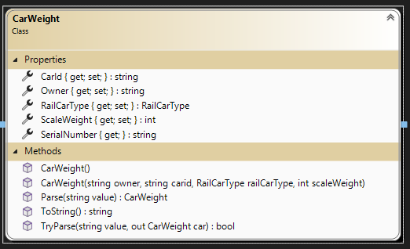
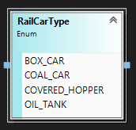
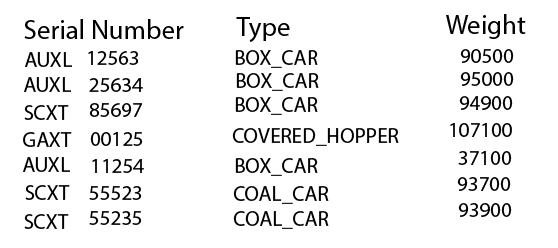
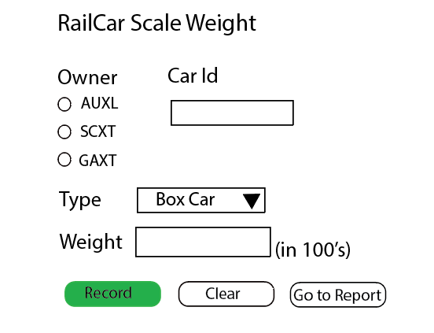

# Train Watch - Web Application and Data Input

> This is the next in a series of exercises to manage information on trains. In this exercise you will create a Blazor web application project. **Train Watch** is a site to keep up-to-date on trains across North America. 
>
> **This set is cumulative**; future exercises in this series will build upon previous exercises.

## Objectives

This exercise will allow you to demonstrate:

- your ability to read and interpret a class diagram
- create a web application with several web component
- implement a data entry component with input validation
- implement a tabular report from a collection of data
- use a CSV file (append data, read and display)
  
## Overview

You are to create a new ASP.NET Core Web Application (Blazor Pages) for this exercise. Create the application using Visual Studio 2022 .Net Core 7. Name your wep app project **`TrainWebApp`**. Name your solution **`TrainWatchSolution`**. Place your work in your exercise repository.

To ensure that your web application works, build and run your project. A browser window should open in a local hosted port.(Example https://localhost:5001 , your port may be different). 

The styling for your application is up to you. The template for the `web app` project has Bootstrap built in, but you can use any website styling you choose.

### Modify `Index.razor`

Modify the home component to include the following.

- The page title of the site (**Train Watch**)
- An `h1` header titled: Train Watch
- A simple logo for the site
- One to two paragraph welcome and summary description of the site
- remove `SurveyPrompt `

### Update the `NavMenu.razor` (leave the current default links on the menu)

- A link to the weight scale component (`/WeightScale`) with the text "Scale"
- A link to the weight report component (`/WeightReport`) with the text "Report"
- A link to the privacy component (`/Privacy`) with the text "Privacy". Place your name and section number on this component as h3 headers.
- Create your own or find an image that you wish to use as a brand image for your menu. (If you are using the supplied bootstrap menu, change the *navbar-brand* from a text string to a thumbnail imagine 80 X 80 pixels.) If you are using an image that someone else created, make sure that you give credit to the individual on your `Privacy` component.

## NOTE: you may place your new components at the same level as the default components in the template.
  
### Modity `Data` folder

You will place your CSV file into this folder. Create a text file called `RailCarWeights.txt` within this folder. For testing, add the first three lines from the sample report below.
Implement the following class defintion. Properties can be auto-implemented. The SerialNumber is a read-only property returning a concatenated string of CarId and Owner.

> ### `Pages you create should have a feed back and error message area`

### Add `WeightReport.razor` component

Add a "Weight Report" component to display the recording of railcar scale weights from a CSV file. A mockup image of the required report is supplied. You will supply an appropriate title for the component. You will read the file and create a collection using your CarWeight class. Your component will display this collection. Display a message if the collection is empty.

### Add `WeightScale.razor` component

Add a "Weight Scale" component to allow the recording of railcar scale weights to a CSV file (append mode). A mockup image of the required component is supplied. Your component does not need to have the same layout **but** must use the variety of controls within the mockup for the same data. You will validate the incoming data and display any fields in error. Individual unique error messages will be used to indicate the error. The owner selection and serial number combined make up the railcar serial number.

#### Validation

- All fields are required.
- Scale weight must be numeric.

#### Submit buttons

- **Record** will validate the incoming data and save to the CSV file if correct.
- **Clear** will reset the fields to empty input state.
- **Go to Report** will transfer the user to the Weight Report page.

Use the class called `CarWeight` to hold the incoming data. The class diagram has been supplied (above). The ToString() will be used to create the record for the CSV file.

----

## Submission

Commit your work in your **exercise** repository and sync to github.com.

## Evaluation

> ***NOTE:** Your code **must** compile. Solutions that do not compile will receive an automatic mark of zero (0).*
> 
> If you are unable to get a portion of the assignment to compile, you should:
> - Comment out the non-compiling portion of code
> - Identify the non-compiling portion with a **Incomplete Requirements** heading, noting the item's
>  

## Marking Rubric

| Weight | Description |
| ----   | --------- |
| **5** | Excellent - no improvement to recommend |  
| **4** | Very Good - work meets requirements;  there are some improvements to the code that is recommended |  
| **3** | Acceptable - coded all the requirements but some requirements are not done as requested; missing or incorrect logic; there are some improvements to the code that is recommended |  
| **2** | Needs Work - coded most of the requirements; code is structured correctly; some requirements are not done as requested; there are major logical errors in the code |   
| **1** | Unsatisfactory - coded some of the requirements; code has syntax errors; some requirements are not done as requested; there are major logic errors |   
| **0** | Not done; compile errors; large component of requirements are missing; work submitted not of the requested software version; work submitted not using the requests templates (such as but not limited to: .Net Core 7, not a Web application using Blazor pages) |  
| ----   | --------- | 
| TBA  | Marks Earned |  
----

----

### Comments:

[Back to Exercise selection](../README.md)
